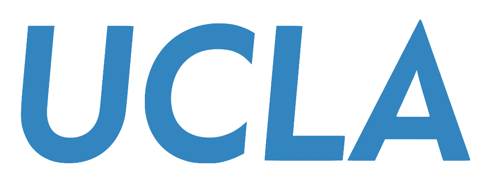
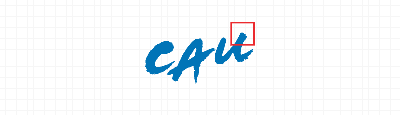

## 🎓 Education

###  University of California, Los Angeles  
*Visiting Graduate Researcher – Mechanical and Aerospace Engineering*  
📍 Mar. 2025 – Mar. 2026 · California, USA

### 
 Korea University  
*Ph.D. – Artificial Intelligence (Expected)*  
📍 Mar. 2024 – Feb. 2029 · Seoul, South Korea

###  Chung-Ang University  
*B.E. – Electrical & Electronic Engineering*  
📍 Mar. 2017 – Feb. 2021 · Seoul, South Korea

## 💪 Skills
**Language**

</a>
</a>
</a>

**Framework**

</a>
</a>
</a>

