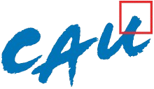

## 🎓 Education

###  University of California, Los Angeles  
*Visiting Graduate Researcher – Mechanical and Aerospace Engineering*  
📍 Mar. 2025 – Mar. 2026 · California, USA

###  Korea University  
*Ph.D. – Artificial Intelligence (Expected)*  
📍 Mar. 2024 – Feb. 2029 · Seoul, South Korea

###  Chung-Ang University  
*B.E. – Electrical & Electronic Engineering*  
📍 Mar. 2017 – Feb. 2021 · Seoul, South Korea

## 📝 Academic Service
- **Conference Reviewer**
  - CVPR 2025 (IEEE/CVF)
  - ICCV 2025 (IEEE/CVF)
  - DLT 2025 (The 29th International Conference on Developments in Language Theory)

## 💻 Skills
- **Languages & Tools**: Python, Shell Script, Git, LaTeX
- **Deep Learning**: PyTorch, PyTorch Lightning, TensorFlow
- **Libraries**: Hugging Face, Scikit-Learn, NumPy, etc

